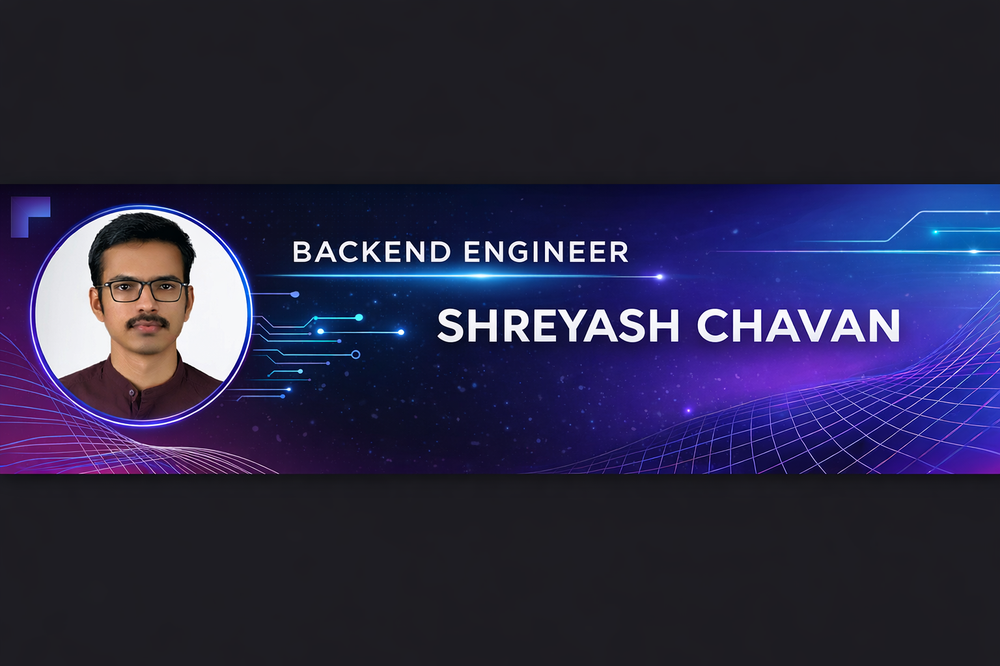

  

<h1 align="center">Hi 👋, I'm Shreyash Chavan</h1>
<h3 align="center">Backend Engineer | Java • Spring Boot • Microservices • Banking Domain</h3>

  

---

## 🚀 About Me

- 💼 Backend Developer working on **Enterprise Banking Platforms**
- 🏦 Specialized in **Retail & Corporate Banking Systems**
- ⚡ Passionate about **Reactive Microservices Architecture**
- 🔐 Focused on Secure & Scalable API Development
- 🌱 Currently exploring **System Design & Cloud Architecture**

---

## 🏢 Professional Experience

### 🏦 VYOM 2.0 – Enterprise Banking Backend  
**Client:** Union Bank of India  

- Developed reactive microservices using Spring WebFlux  
- Implemented CQRS for optimized read/write operations  
- Improved API performance by 20–30%  
- Reduced redundant service calls by 40–50%  
- Integrated Cassandra & PostgreSQL  
- Implemented JWT-based authentication  

---

### 🏦 Retail & Corporate Banking Enhancements  
**Client:** Bank of India  

- Delivered 50% enhancements ahead of timeline  
- Standardized exception handling across services  
- Reduced debugging effort by 25%  
- Optimized caching for frequently accessed data  
- Improved workflow automation by 20%  

---

## 🛠 Languages and Tools

  

---

## 📊 GitHub Stats

  

  

---

## 📫 Connect With Me

  

